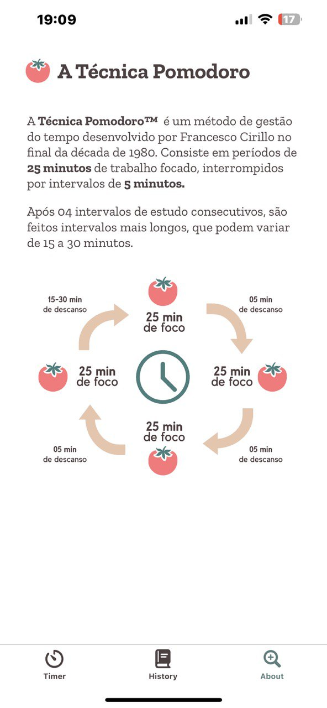
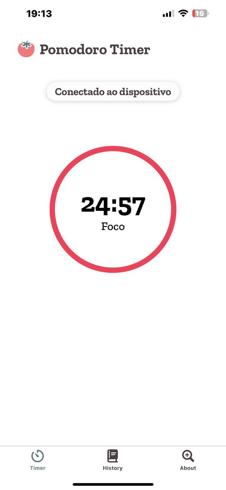
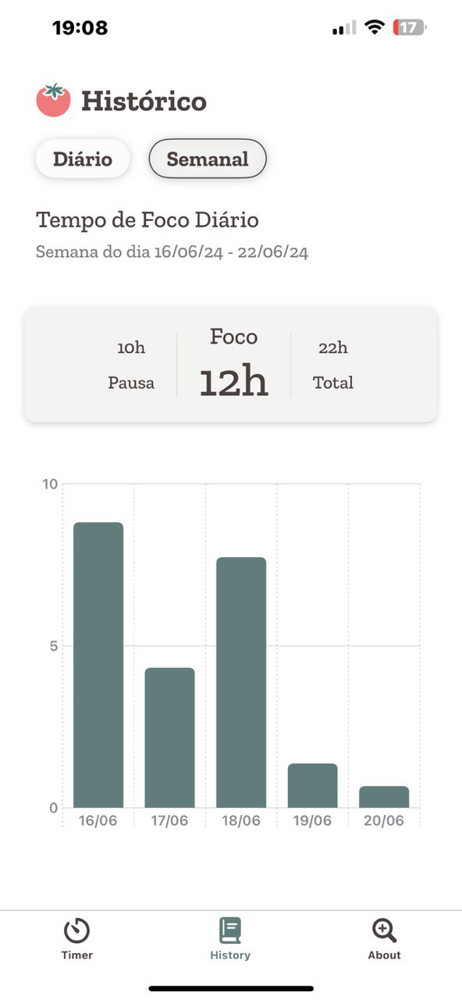
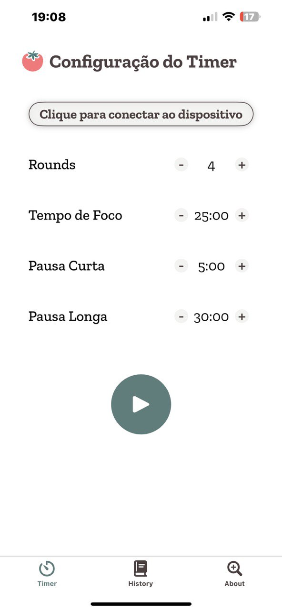

# 🍅 Tomatinho: Uso de IoT para Aumentar a Produtividade Utilizando a Técnica Pomodoro

**Tomatinho** é uma solução de IoT projetada para facilitar a aplicação da técnica Pomodoro, ajudando a aumentar a produtividade e reduzir distrações. Utilizando a placa Wemos D1 R32 e um aplicativo desenvolvido em SwiftUI, o dispositivo permite que usuários configurem e monitorem seus ciclos de foco e descanso sem a necessidade de interações constantes com celulares ou computadores.

---

## 📱 Telas do Aplicativo

  
  
  
  

---

## 🚀 Funcionalidades
- **Automação da Técnica Pomodoro**: Configuração simplificada de tempos de foco e pausa, com transições automáticas entre ciclos.
- **Redução de Distrações**: Elimina a necessidade de dispositivos móveis durante os ciclos, minimizando interrupções.
- **Estatísticas de Produtividade**: O aplicativo exibe dados sobre o desempenho diário e semanal do usuário.
- **Hardware Inteligente**: Inclui um cronômetro físico com exibição de tempos e alertas sonoros.

---

## 🛠️ Tecnologias Utilizadas
### **Hardware**
- **Wemos D1 R32**: Microcontrolador baseado no ESP32, com conectividade Bluetooth Low Energy (BLE).
- **Módulo RTC DS1302**: Para manter a contagem de tempo precisa.
- **Display de 7 Segmentos**: Exibe o tempo restante em cada ciclo.
- **Buzzers e Botões**: Emitir alertas e permitir interação direta com o dispositivo.

### **Software**
- **SwiftUI**: Framework para o desenvolvimento do aplicativo em iOS, garantindo uma interface moderna e intuitiva.
- **Arduino IDE**: Para programar a placa Wemos D1 R32.

---

## 📊 Resultados
- **Produtividade Aumentada**: Todos os participantes dos testes relataram uma melhora significativa no foco e no desempenho ao utilizar o Tomatinho.
- **Feedback Positivo**: 87,5% dos usuários ficaram completamente satisfeitos com o dispositivo.
- **Redução de Distrações**: 62,5% dos participantes confirmaram uma diminuição no uso do celular.

---

## 🔍 Como Funciona
1. Configure os tempos de foco e descanso no aplicativo.
2. O aplicativo envia os dados para o dispositivo via Bluetooth.
3. O dispositivo inicia o cronômetro e exibe o tempo no display.
4. Alertas sonoros sinalizam as transições entre ciclos.

---

## 📖 Publicação

O artigo sobre o projeto **Tomatinho** foi publicado no **XXV Simpósio de Sistemas Computacionais de Alto Desempenho**. Você pode acessar a publicação completa [aqui](https://sol.sbc.org.br/index.php/sscad_estendido/article/view/30973).

---

## 💡 Próximos Passos
- Suporte multiplataforma para Android.
- Desenvolvimento de um design compacto com bateria integrada.
- Adição de funcionalidades, como compartilhamento de estatísticas com amigos.

---
